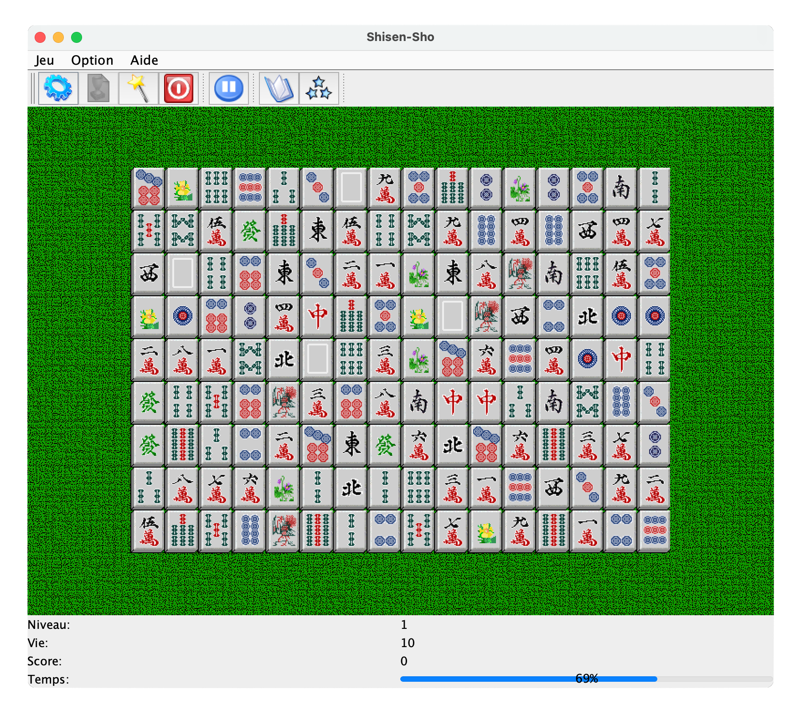

<h1 align="center"><a href="https://github.com/anthonyliot/shisensho/releases/tag/v1.0">SHISENSHO</a></h1>

<strong>Japanese tile-based game in java</strong>
 2007

 
<h2>About</h2>
This project was developed during my bachelor degree in Caen, France. 
Shisen-Sho sometimes referred to as 'Shisen', 'Four Rivers' or simply 'Rivers', is a Japanese tile-based game which uses Mahjong tiles, and is similar to Mahjong solitaire. The objective of the game is to match similar tiles in pairs until every tile has been removed from the playing field. Numerous computer based versions of the game have been developed.
 
You can download the JAR file and try it <a href="https://github.com/anthonyliot/shisensho/releases/tag/v1.0">here</a>

<h2>Installation</h2>

1. Download this project as zip and extract it
2. Download <a href="https://netbeans.apache.org">Apache Netbeans</a>
3. Import the project and choose build and run.

<h2>Copyright</h2>
This project is licensed under the terms of the MIT license. See <a href="LICENSE">license</a>.